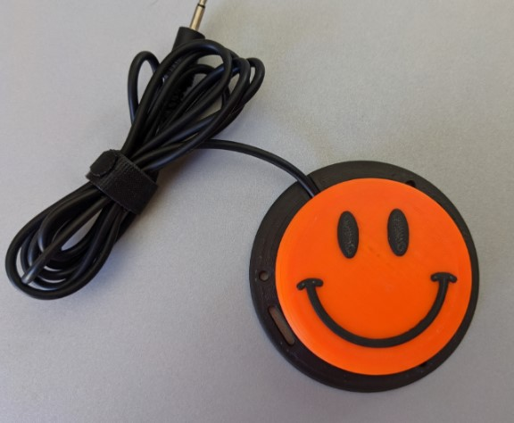

 # Interact Switch
<!---  SUMMARY A brief summary of the project. What it does, who it is for, how much it costs. --->

The Interact Switch is an open source assistive switch. The switch is comprised of 3D printed parts and off-the-shelf electronics. The Interact Switch is a high quality, modular 3D printable switch design. The tactile feel of the switch is on par with commercial switches, coming in at about 35 g of activation force across the surface of the switch. The base has the same footprint as a Jellybean switch, and should work with any Jellybean switch mounts.

There are a wide array of different designs: from a simple flat button, to textured designs, to a dome, and even some wobble switch variants.

The switch base incorporates 6 slots that are ideal for a variety of mounting options, including using hook and loop straps (e.g., VELCRO). The overall cost of materials is about $8 (plus $8 for component shipping).

## More info at
- [Makers Making Change Library Page](https://www.makersmakingchange.com/s/product/interact-switch/01tJR000000698vYAA)

## How to Obtain the Device
### 1. Do-it-Yourself (DIY) or Do-it-Together (DIT)

This is an open-source assistive technology, so anyone is free to build it. All of the files and instructions required to build the device are contained within this repository. Refer to the Maker Guide below.

### 2. Request a build of this device

You may also submit a build request through the [MMC Library Page](https://www.makersmakingchange.com/s/product/interact-switch/01tJR000000698vYAA) to have a volunteer maker build the device. As the requestor, you are responsible for reimbursing the maker for the cost of materials and any shipping.

### 3. Build this device for someone else

If you have the skills and equipment to build this device, and would like to donate your time to create the device for someone who needs it, visit the [MMC Maker Wanted](https://makersmakingchange.com/maker-wanted/) section.

## Build Instructions

### 1. Read through the Maker Guide

The Maker Guide (WIP) <!---([EN](/Documentation/Interact_Switch_Maker_Guide.pdf),[FR](/Documentation/FR_Interact_Switch_Maker_Guide.pdf)) --->  contains all the necessary information to build this device, including tool lists, assembly instructions, programming instructions (if applicable) and testing.

### 2. Order the Off-The-Shelf Components

The Bill of Materials (WIP) <!--- (/Documentation/Interact_Switch_BOM.xlsx) ---> lists all of the parts and components required to build the Interact Switch. The main switch component needs to be ordered online. The rest of the off-the-shelf components are also online or may be available in smaller quantities at your local hardware store or dollar store.

### 3. Print the 3D Printable components

All of the individual print files can be found in the [/Build_Files/3D_Printing_Files](/Build_Files/3D_Printing/) folder.

### 4. Assemble the <Device-Name>

Reference the Assembly Guide([EN](/Documentation/Interact_Switch_Assembly_Guide.pdf),[FR](/Documentation/FR_Interact_Switch_Assembly_Guide.pdf)) for the tools and steps required to build each portion.

## How to improve this Device
As open source assistive technology, you are welcomed and encouraged to improve upon the design. 

## Files
### Documentation
| Document             | Version | Link |
|----------------------|---------|------|
| Design Rationale     | 1.0     | WIP <!--- [DeviceName_Design_Rationale](/Documentation/Device-Name_Design_Rationale.pdf) --->     |
| Maker Guide          | 1.0     | WIP <!--- [DeviceName_Maker_Checklist](/Documentation/Device-Name_Maker_Guide.pdf)  --->   |
| Bill of Materials    | 1.0     | WIP <!--- [DeviceName_Bill_of_Materials](/Documentation/Device-Name_BOM.xlsx)   --->  |
| User Guide           | 1.0     | WIP <!--- [DeviceName_User_Guide](/Documentation/Device-Name_Quick_Guide.pdf)   ---> |
| Changelog            | 1.0     | WIP <!--- [DeviceName_Changelog](CHANGES.txt)     |

### Design Files
<!--- DESIGN FILES If possible, include a copy of original design files to facilitate easy editing and customization. --->
 - [CAD Files](/Design_Files/CAD_Design_Files)

### Build Files
 - [3D Printing Files](/Build_Files/3D_Printing)

## Attribution
The [original design](https://github.com/mwturvey/InteractSwitch) of the Interact Switch was by Mike Turvey.

Modifications to the design and additional documentation by Neil Squire Society / Makers Making Change.
  - Increases the screw hole size in the ButtonCapHolder to accept both M2.5 screws as well as #4 3/8" screws.
  - Lines up the holes in the base with the holes in the ButtonCapHolder.
  - Deepens the countersink in the Base for the screws.
  - Removes the need for supports on the Base piece.
  - Decreases the required sanding by tapering the tabs on the ButtonCapHolder.  

---

<!-- ABOUT MMC START -->
## About Makers Making Change

Makers Making Change is a program of [Neil Squire](https://www.neilsquire.ca/), a Canadian non-profit that uses technology, knowledge, and passion to empower people with disabilities.

Makers Making Change leverages the capacity of community based Makers, Disability Professionals and Volunteers to develop and deliver affordable Open Source Assistive Technologies.

 - Website: [www.MakersMakingChange.com](https://www.makersmakingchange.com/)
 - GitHub: [makersmakingchange](https://github.com/makersmakingchange)
 - Instagram: [@makersmakingchange](https://www.instagram.com/makersmakingchange)
 - Facebook: [makersmakechange](https://www.facebook.com/makersmakechange)
 - LinkedIn: [Neil Squire Society](https://www.linkedin.com/company/neil-squire-society/)
 - Thingiverse: [makersmakingchange](https://www.thingiverse.com/makersmakingchange/about)
 - Printables: [MakersMakingChange](https://www.printables.com/@MakersMakingChange)

### Contact Us
For technical questions, to get involved, or to share your experience we encourage you to [visit our website](https://www.makersmakingchange.com/) or [contact us](https://www.makersmakingchange.com/s/contact).
<!-- ABOUT MMC END -->
